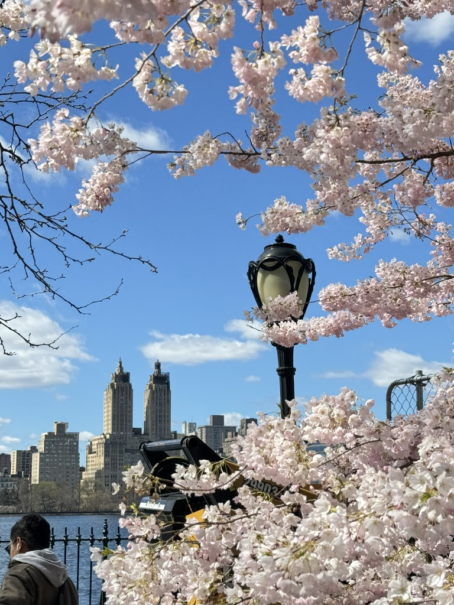

<!DOCTYPE html>
<html lang="en">
<head>
    <meta charset="UTF-8">
    <meta name="viewport" content="width=device-width, initial-scale=1.0">
    <title>Edgar's Creative Portfolio</title>
    
</head>
<body>
    <header>
        <h1>Edgar's Creative Portfolio</h1>
    </header>
    <nav>
        <a href="#about">About</a>
        <a href="#projects">Projects</a>
        <a href="#gallery">Gallery</a>
        <a href="#blog">Blog</a>
        <a href="#contact">Contact</a>
    </nav>
    

        <section id="about" class="about">
            <h2>About Me</h2>
            
Hi, I'm Edgar Haro, a 31-year-old Californian living in New York City. After a tumultuous childhood and upbringing, I am proof that it gets better. I am living an incredible life, filled with hope and endless possibilities. Welcome to my creative portfolio where I showcase my projects, memories, and experiences.

        </section>
        <section id="projects" class="projects">
            <h2>Projects</h2>
            

                
                <h3>Project Title 1</h3>
                
Brief description of the project.

            

            

                
                <h3>Project Title 2</h3>
                
Brief description of the project.

            

            

                
                <h3>Project Title 3</h3>
                
Brief description of the project.

            

        </section>
        <section id="gallery" class="gallery">
            <h2>Gallery</h2>
            

                
            

            

                
            

            

                
            

        </section>
        <section id="blog" class="blog">
            <h2>Blog</h2>
            

                <h3>Blog Post Title 1</h3>
                
Summary or excerpt of the blog post.

            

            

                <h3>Blog Post Title 2</h3>
                
Summary or excerpt of the blog post.

            

            

                <h3>Blog Post Title 3</h3>
                
Summary or excerpt of the blog post.

            

        </section>
        <section id="contact" class="contact">
            <h2>Contact Me</h2>
            
If you'd like to get in touch, feel free to email me at: <a href="mailto:edgar@example.com">edgar@example.com</a>

        </section>
    

    <footer>
        
&copy; 2024 Edgar Haro. All Rights Reserved.

    </footer>
</body>
</html>
